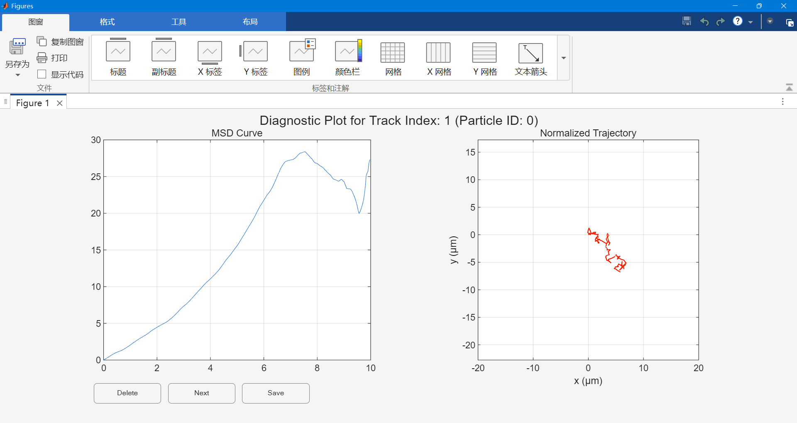

# MSD Analysis  

## A brief description 

This MATLAB script provides a comprehensive, all-in-one workflow for analyzing particle trajectory data. It's designed to process raw tracking data from a CSV file, guide the user through an interactive data cleaning process, perform Mean Squared Displacement (MSD) analysis, and export publication-quality plots and data.

The workflow is built around the powerful *@msdanalyzer* class developed by Jean-Yves Tinevez.

### Key Features 

- **Data Import**: This script expects the particle trajectory data provided in a standard CSV file.

- **Interactive Curation**: A graphical user interface (GUI) allows you to inspect each trajectory and its corresponding MSD curve, making it simple to discard invalid tracks.

- **Velocity Analysis**: Automatically calculates and visualizes instantaneous velocity distribution and velocity correlation for diagnostic purposes.

- **MSD Calculation & Fitting**: Computes individual and mean MSD curves, performs a linear fit to determine the diffusion coefficient ($D$), and assesses the goodness of fit ($R^2$).

- **Automated Export**: Generates clean CSV files and publication-ready plots of the final Mean MSD data with error bars.

### Prerequisites 

- **MATLAB**: The scirpt was written via a recent version of MATLAB (R2025a)
- **@msdanalyzer Class**: This script is a wrapper for the @msdanalyzer class. You must [download it](https://github.com/tinevez/msdanalyzer) and add it to your MATLAB path.

## A step-by-step tutorial

0. **Prepare your data**
    - Organize your files as follows:

    ```
    /your_project_folder
    |
    |-- msd_analysis_scipt.m (This script)
    |-- @msdanalyzer/ (The downloaded msdanalyzer folder)
    |-- Trajectory Data/
    |-- your_data_file.csv
    ```

    - Prepare your CSV file. Your file must contain the following headers:
        - particle_id: A unique identifier for each particle.
        - frame: The frame number each partilce belongs to.
        - x: The x-coordinate of the particle.
        - y: The y-coordinate of the particle

1. **Define constants and load data files**
    - You need to acquire the conversion factor (pixels -> micrometers) from your experimental setup, and replace it with the one in the following code.
    - *time_interval* and *filePath* also need to be replaced with the corresponding values. 
    ```
    % --- Section 1. Define constants and specify file paths ---
    % --- 小节 1. 定义常数和指定文件路径
    disp('--- Section 1: Define Constants and Specify File Paths ---');

    % Define the conversion factor from pixels to micrometers
    % 定义换算常数（像素 -> 微米）
    microns_per_pixel = 273.2/1436;

    % Define the time interval between frames in seconds (e.g., 30 fps -> 1/30 s)
    % 定义两帧的时间区间（30 帧/秒对应的时间区间是 1/30）
    time_interval = 1/30; 

    % Define the path to your data file
    % 定义粒子轨迹文件路径
    filePath = 'Trajectory Data/combined_trajectories_for_msd (5mM H2O2 5800-6099_6150-6449frames).csv';
    ```
    - Put your CSV file in the fold named *Trajectory Data*.
2. **Data Loading and Preprocessing**
The script first loads your CSV data into a MATLAB table. It then converts all pixel coordinates to micrometers and organizes the data into a cell array named tracks, where each cell contains the full trajectory (time, x, y) for a single particle.

    - **Load and Read CSV file**
    The csv file to be processed should contain the information of each particle's ID, frame number, and x/y-coordinates. As the following example csv file shows: 
    
    
    Once the csv is loaded successfully, you can check the table storing all information in the worksapce: 
    
    
    - **All trajectories are stored in a Cell Array Named tracks for later analysis**
    *tracks* is an $N \times 1$ (N = numParticles, i.e., the number of particles) cell array which looks like this: 
    
    
    You can check each entry by simply clicking it: 
    
    
    The first column is the time vector, and the second and the third are the x-coordinates and y-coordinates, respectively.
    - **Tracjectories are normalized for beeter visualization**
    Since the starting point may vary drastically from point to point, which would affects the plottting and make visualization difficult, hence for better view, normalization shifts the starting point of all particles to the origin $(0 , 0)$. 
3. **Interactive Trajectory Curation**
This is the most critical interactive step. A figure window will pop up, showing a diagnostic plot for each particle trajectory, one by one.
    - Use the buttons at the bottom of the window to decide the fate of each trajectory:
        - Press *Delet* to delet invalid trajectories;
        - Press *Next* to continue inspection;
        - Press *Save* to save the desired figure;

    

4. **Visualizing Instantaneous Velocity Distribution & Velocity Correlation**
Once you have finished curating your tracks, the script automatically generates two diagnostic plots based on the remaining trajectories:
    - **Veocity Distribution**: A histogram of the instantaneous velocities ($v_x ~\text{and}~ v_y$). For pure Brownian motion, this distribution should be a Gaussian distribution centered at zero.
    
    
    - **Velocity Correlation**: A plot showing how the velocity is correlated over time. For pure Brownian motion, this should be zero for all time except at $\Delta t=0$.
    

5. **Visualizing MSD, MeanMSD, and fitting curve**
    - *plotMSD* plots all the mean square displacement curves.
    
    
    - *plotMeanMSD* plots the weighted mean of all MSD curves, meanwhile *fitMeanMSD* returns a fitting curve with the goodness of fittting ($R^2$), which is plotted on the same figure.
    
    
    - The calculated diffusion coefficient and Goodness of fitting will be displayed in the command window:
    

6. **Export Results** 
Finally, the script automatically generates the final outputs based on the filtered and analyzed data. It creates two sets of results with two distinct time limits (1.5s and 2.0s by default). For each time limit, you will obtain:
    - **A CSV file** (e.g. MSD_for_publication_Filtered_1.5s.csv): This file contains the time data, Mean MSD, Standard Error of the Mean (SEM), the Diffusion Coefficient (D) and the goodness of fitting ($R^2$). You can find it in a folder named *MSD Data*.
    

    - **An MSD Figure**: A polished figure showing the Mean MSD with SEM error bars, a clear title reporting the diffusion coefficient, and properly labeled axes. 
     

## Citing the Tool: msdanalyzer

- This script relies on the @msdanalyzer class, which was developed by Jean-Yves Tinevez. For more information on @msdanalyzer, please go to [Github](https://github.com/tinevez/msdanalyzer) or [MATLAB community](https://ww2.mathworks.cn/matlabcentral/fileexchange/40692-mean-square-displacement-analysis-of-particles-trajectories).

- I sincerely appreciate Jean-Yves’ contribution in developing the tool @msdanalyzer.
